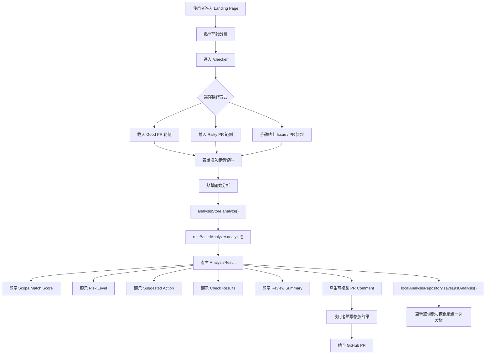
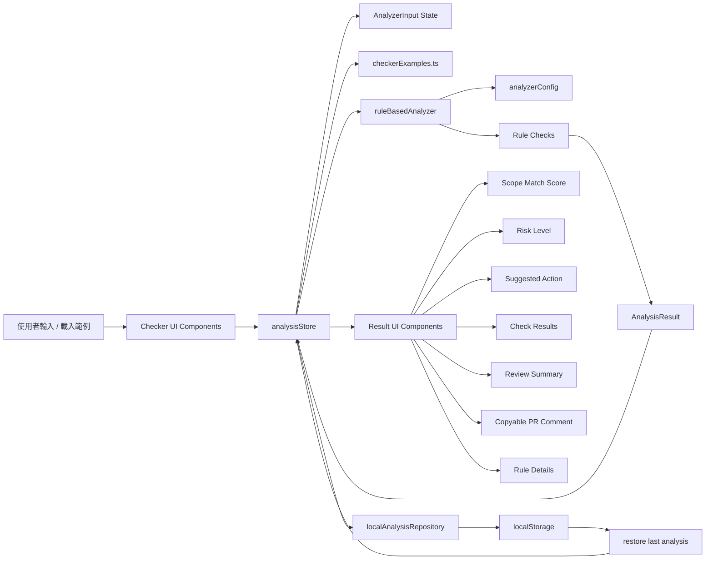
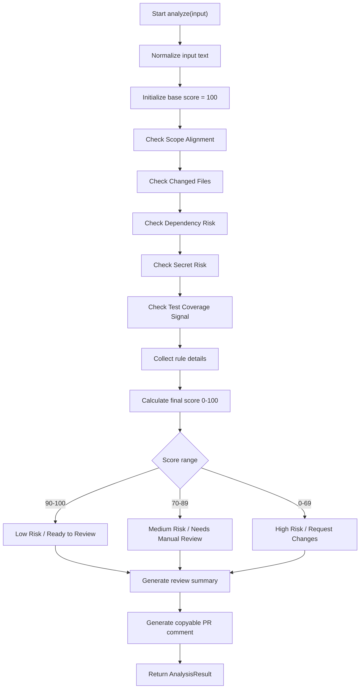
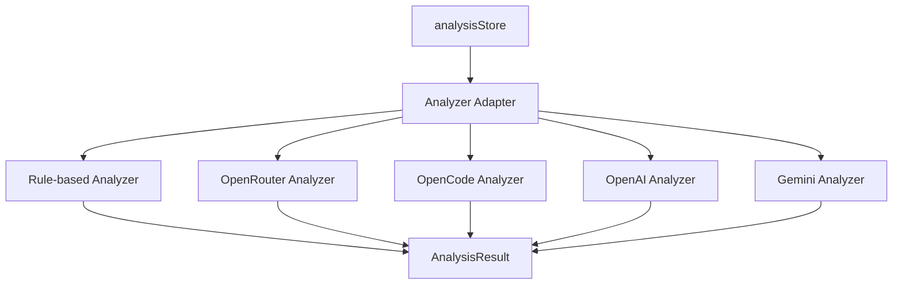

# AI Issue Scope Guard - DESIGN.md

## 1. Project Overview

`AI Issue Scope Guard` 是一個 Vue 3 + TypeScript 製作的 AI-assisted development workflow 工具。

本專案主要用於展示：

- 使用者主力為 React / Next.js，但能快速學習並實作 Vue 3。
- 具備模組化前端架構設計能力。
- 能設計具產品感的 developer productivity tool。
- 能理解 GitHub Issue → AI Agent 實作 → PR Review 的實務流程。

核心功能：

使用者手動貼上 Issue / PR 相關資訊，工具會以 rule-based analyzer 進行範圍檢查，產出：

- Scope Match Score
- Risk Level
- Suggested Action
- Check Results
- Review Summary
- Copyable PR Comment
- Rule Details

---

## 2. Product Goal

### Goal

建立一個可部署、可展示、可互動的 Vue 3 前端工具，用來協助 AI-assisted developers 檢查 AI Agent 產出的 PR 是否符合原本 GitHub Issue 的 Scope。

### Primary User

AI-assisted developers，例如使用：

- Codex
- Claude Code
- Copilot Agent
- OpenCode
- 其他 AI coding agent

### Core User Scenario

```txt
Issue spec
→ AI Agent 實作
→ PR summary / changed files / test result
→ 使用者貼到 Scope Guard
→ Rule-based analyzer 分析
→ 產出 review 建議
→ 使用者複製 PR comment 貼回 GitHub
```

---

## 3. MVP Scope

### In Scope

MVP 支援：

- Vue 3 + Vite + TypeScript
- Vue Router
- Pinia
- Vitest + Testing Library
- 深色主題 UI
- `/checker` 雙欄工作區
- 手動貼資料
- Good PR / Risky PR 範例資料
- 基本互動
- Rule-based analyzer
- 最後一次分析 localStorage 保存
- `/rules` 規則說明頁
- `/` Landing page
- Netlify deployment config

### Out of Scope

MVP 不做：

- GitHub API
- GitHub OAuth
- GitHub Issue / PR URL import
- Full diff parser
- AI API
- OpenRouter / OpenAI / Gemini 真實串接
- Supabase / Database
- Login / Auth
- 多筆 history
- Team workspace
- UI library
- Tailwind CSS
- 大型 plugin system

---

## 4. Tech Stack

```txt
Vue 3
Vite
TypeScript
Vue Router
Pinia
Vitest
Testing Library
Scoped CSS / CSS Modules
npm
Netlify
```

### Dependency Rules

- 不使用 UI library。
- 不使用 Tailwind CSS。
- 不使用 Element Plus / Vuetify / Naive UI / Ant Design Vue。
- 不新增不必要 dependency。
- 若需要新增套件，必須由 GitHub Issue 明確要求。

---

## 5. Architecture Principles

本專案採用「輕量模組化架構」。

### 設計原則

- UI、頁面、狀態、資料、分析邏輯分離。
- Vue component 不直接承載複雜 business logic。
- analyzer 邏輯不可寫死在 page component。
- localStorage 邏輯不可散落在 component。
- example data 獨立管理。
- TypeScript types 集中管理。
- 保持可擴充，但不做過早抽象。

### 不採用

- 不採用 Clean Architecture 完整分層。
- 不採用 plugin system。
- 不採用 monorepo。
- 不採用 dependency injection container。
- 不做過度抽象。

---

## 6. App Structure

建議目錄結構：

```txt
src/
  app/
    App.vue
    router.ts

  pages/
    LandingPage.vue
    CheckerPage.vue
    RulesPage.vue

  components/
    layout/
      AppHeader.vue
      AppFooter.vue
      AppShell.vue

    ui/
      AppButton.vue
      AppCard.vue
      AppBadge.vue
      AppTextarea.vue
      SectionHeader.vue

    checker/
      ExampleSwitcher.vue
      CheckerInputPanel.vue
      CheckerInputField.vue
      AnalysisSummaryCards.vue
      CheckResultsPanel.vue
      CheckResultItem.vue
      ReviewSummaryCard.vue
      CopyablePrComment.vue
      RuleDetailsPanel.vue

  stores/
    analysisStore.ts

  services/
    analyzer/
      analyzer.types.ts
      analyzerConfig.ts
      ruleBasedAnalyzer.ts
      index.ts

    persistence/
      persistence.types.ts
      localAnalysisRepository.ts
      index.ts

  data/
    checkerExamples.ts

  types/
    checker.ts
    analysis.ts

  styles/
    tokens.css
    global.css
```

---

## 7. Module Responsibilities

### `pages/`

負責頁面組合，不放複雜邏輯。

```txt
LandingPage.vue
CheckerPage.vue
RulesPage.vue
```

頁面只負責：

- 組合 layout
- 引入區塊元件
- 呼叫 store action
- 控制頁面級事件

### `components/layout/`

負責全站共用 layout。

```txt
AppHeader.vue
AppFooter.vue
AppShell.vue
```

用途：

- Navigation
- Footer
- Page shell
- 全站主視覺框架

### `components/ui/`

負責純 UI 元件。

```txt
AppButton.vue
AppCard.vue
AppBadge.vue
AppTextarea.vue
SectionHeader.vue
```

特性：

- 不知道 checker business logic
- 只接收 props
- 不直接操作 store
- 可重複用於 Landing / Checker / Rules

### `components/checker/`

負責 checker 專用 UI。

```txt
ExampleSwitcher.vue
CheckerInputPanel.vue
CheckerInputField.vue
AnalysisSummaryCards.vue
CheckResultsPanel.vue
CheckResultItem.vue
ReviewSummaryCard.vue
CopyablePrComment.vue
RuleDetailsPanel.vue
```

特性：

- 可知道 checker domain types
- 不直接寫 analyzer 規則
- 不直接寫 localStorage
- 透過 props / emit 或 store 連接資料

### `services/analyzer/`

負責分析邏輯。

```txt
analyzer.types.ts
analyzerConfig.ts
ruleBasedAnalyzer.ts
index.ts
```

職責：

- 接收 checker input
- 根據規則計算 score
- 判斷 risk level
- 產生 suggested action
- 產生 check results
- 產生 rule details
- 產生 review summary / PR comment 所需資料

未來擴充：

```txt
aiAnalyzerAdapter.ts
openRouterAnalyzer.ts
openCodeAnalyzer.ts
openAiAnalyzer.ts
geminiAnalyzer.ts
```

但 MVP 不實作。

### `services/persistence/`

負責資料保存。

```txt
persistence.types.ts
localAnalysisRepository.ts
index.ts
```

MVP 只做：

- 保存最後一次 input
- 保存最後一次 analysis result
- 從 localStorage 還原

未來可擴充：

```txt
supabaseAnalysisRepository.ts
apiAnalysisRepository.ts
```

但 MVP 不接資料庫。

### `stores/`

負責全域狀態。

```txt
analysisStore.ts
```

職責：

- 保存目前輸入
- 保存目前分析結果
- 載入 Good PR / Risky PR example
- 執行 analyze action
- 呼叫 persistence repository
- 管理 last analysis 狀態

### `data/`

放靜態資料。

```txt
checkerExamples.ts
```

內容：

- Good PR example
- Risky PR example

### `types/`

放跨模組共用型別。

```txt
checker.ts
analysis.ts
```

原則：

- component-specific type 可留在 component 附近。
- 跨 services / store / components 共用的 type 放在 `types/` 或 `services/analyzer/analyzer.types.ts`。

---

## 8. Page Structure

### `/` Landing Page

目的：

- 說明產品定位
- 展示 AI-assisted development workflow
- 引導使用者進入 `/checker`

區塊：

```txt
Hero
Feature Cards
Workflow Section
Future Extension Section
CTA
Footer
```

### `/checker` Scope 分析工作區

目的：

- 核心工具頁
- 手動貼資料
- 顯示分析結果
- 複製 PR comment

版型：

```txt
Top Navigation
Page Header
Main Workspace
  Left: Input Panel
  Right: Result Panel
Footer
```

左側輸入：

```txt
Issue Spec
PR Summary
Changed Files
Test Result
Dependency Changes
```

右側輸出：

```txt
Scope Match Score
Risk Level
Suggested Action
Check Results
Review Summary
Copyable PR Comment
Rule Details
```

### `/rules` Rule-based Analyzer 規則說明

目的：

- 說明 MVP 是 rule-based analyzer
- 提供透明扣分邏輯
- 避免被誤解為已串 AI API

區塊：

```txt
Rule-based Analyzer Intro
Score Logic
Risk Level Mapping
Current Check Items
MVP Limitations
Future Roadmap
Footer
```

---

## 9. Analyzer Design

### Input

```ts
type AnalyzerInput = {
  issueSpec: string
  prSummary: string
  changedFiles: string
  testResult: string
  dependencyChanges: string
}
```

### Output

```ts
type AnalysisResult = {
  score: number
  riskLevel: 'low' | 'medium' | 'high'
  suggestedAction: 'ready-to-review' | 'needs-manual-review' | 'request-changes'
  checkResults: CheckResult[]
  reviewSummary: string
  prComment: string
  ruleDetails: RuleDetail[]
}
```

### Check Items

```txt
Scope Alignment
Changed Files
Dependency Risk
Secret Risk
Test Coverage Signal
```

### Score Mapping

```txt
90 - 100：Low Risk / Ready to Review
70 - 89：Medium Risk / Needs Manual Review
0 - 69：High Risk / Request Changes
```

### Rule Details

每條規則需要包含：

```ts
type RuleDetail = {
  id: string
  label: string
  matched: boolean
  impact: number
  reason: string
}
```

---

## 10. Persistence Design

MVP 只保存最後一次分析。

### Save Timing

```txt
使用者按下 Analyze
→ store 更新 result
→ localAnalysisRepository.saveLastAnalysis()
```

### Restore Timing

```txt
App / Checker page mounted
→ analysisStore.loadLastAnalysis()
→ localAnalysisRepository.getLastAnalysis()
→ 還原 input 與 result
```

### Storage Key

```txt
ai-issue-scope-guard:last-analysis
```

---

## 11. Commenting Rules

因為本專案同時是 Vue 3 學習專案，程式碼需要補充繁體中文註釋。

### 必須註釋的地方

- Vue Composition API 使用處
- `ref`
- `computed`
- `watch`
- `props`
- `emit`
- Pinia store action
- Vue Router 設定
- analyzer 規則判斷
- localStorage 讀寫
- 資料流和 React 寫法差異較大的地方

### 註釋原則

- 解釋「為什麼這樣寫」。
- 解釋 Vue 的資料流。
- 不要只翻譯程式碼。
- 不要對簡單 HTML / CSS class 過度註釋。
- 註釋使用繁體中文。
- 技術名詞可保留英文。

---

## 12. Design System Direction

### Visual Style

```txt
Premium AI Tool
Dark Theme
Blue / Purple Accent
Developer Tool
High readability
Card-based layout
Subtle glow
Thin borders
Rounded corners
Desktop first
```

### Color Direction

```txt
Background: deep navy / charcoal
Surface: dark blue-gray
Border: muted blue-gray
Primary Accent: blue-purple gradient
Success: green
Warning: yellow / amber
Danger: red
Text: near-white
Muted Text: blue-gray
```

### UI Components

```txt
AppButton
AppCard
AppBadge
AppTextarea
SectionHeader
ScoreCard
ResultPanel
CopyButton
```

---

## 13. RWD Strategy

### Desktop First

主要使用情境為桌機 / 筆電。

`/checker` 桌機版：

```txt
Left input panel
Right result panel
```

### Mobile Basic Support

小螢幕只要求：

- 不破版
- 可閱讀
- 可輸入
- 可複製
- 左右欄改為上下排列

不做：

- mobile first
- App-like mobile workflow
- 手機長文字輸入優化

---

## 14. User Flow Mermaid



---

## 15. App Structure Mermaid

```mermaid
flowchart TD
  App["App.vue"] --> Router["Vue Router"]

  Router --> Landing["/ LandingPage.vue"]
  Router --> Checker["/checker CheckerPage.vue"]
  Router --> Rules["/rules RulesPage.vue"]

  Landing --> Layout["components/layout"]
  Checker --> Layout
  Rules --> Layout

  Layout --> Header["AppHeader.vue"]
  Layout --> Footer["AppFooter.vue"]
  Layout --> Shell["AppShell.vue"]

  Checker --> CheckerComponents["components/checker"]
  CheckerComponents --> ExampleSwitcher["ExampleSwitcher.vue"]
  CheckerComponents --> InputPanel["CheckerInputPanel.vue"]
  CheckerComponents --> InputField["CheckerInputField.vue"]
  CheckerComponents --> SummaryCards["AnalysisSummaryCards.vue"]
  CheckerComponents --> ResultsPanel["CheckResultsPanel.vue"]
  CheckerComponents --> CommentBlock["CopyablePrComment.vue"]
  CheckerComponents --> RuleDetails["RuleDetailsPanel.vue"]

  Landing --> UI["components/ui"]
  CheckerComponents --> UI
  Rules --> UI

  UI --> Button["AppButton.vue"]
  UI --> Card["AppCard.vue"]
  UI --> Badge["AppBadge.vue"]
  UI --> Textarea["AppTextarea.vue"]
  UI --> SectionHeader["SectionHeader.vue"]

  Checker --> Store["stores/analysisStore.ts"]
  Store --> Analyzer["services/analyzer/ruleBasedAnalyzer.ts"]
  Store --> Persistence["services/persistence/localAnalysisRepository.ts"]
  Store --> Examples["data/checkerExamples.ts"]

  Analyzer --> AnalyzerTypes["services/analyzer/analyzer.types.ts"]
  Persistence --> PersistenceTypes["services/persistence/persistence.types.ts"]
```



---

## 16. Data Flow Mermaid



---

## 17. Analyzer Flow Mermaid



---

## 18. Future Extension Architecture

MVP 使用：

```txt
ruleBasedAnalyzer
localAnalysisRepository
```

未來可擴充：

```txt
aiAnalyzerAdapter
openRouterAnalyzer
openCodeAnalyzer
openAiAnalyzer
geminiAnalyzer
supabaseAnalysisRepository
apiAnalysisRepository
```

### Future Analyzer Adapter



MVP 不實作這些 provider，只保留架構方向。

---

## 19. Development Roadmap

### Phase 1：Bootstrap

```txt
建立 Vue 3 project
建立 router
建立 Pinia
建立 basic layout
建立 pages
建立 AGENTS.md
確認 build / test
```

### Phase 2：Checker UI

```txt
依照 Figma 設計稿建立 /checker 深色 UI
完成左側輸入區
完成右側結果區
完成範例切換
完成基本分析按鈕
完成複製評語按鈕
```

### Phase 3：Analyzer

```txt
建立 rule-based analyzer
計算 score / risk / action
產生 check results
產生 rule details
補 analyzer tests
```

### Phase 4：State + Persistence

```txt
建立 Pinia analysisStore
整合 analyzer
整合 localStorage last analysis
```

### Phase 5：Rules Page

```txt
建立 /rules
說明規則邏輯
說明 MVP limitation
說明 future roadmap
```

### Phase 6：Landing Page

```txt
建立 /
產品介紹
workflow
feature cards
CTA to /checker
```

### Phase 7：Tests + Deployment

```txt
補標準測試
確認 build
新增 netlify.toml
補 README
部署 Netlify
```

---

## 20. Codex Implementation Rules

Codex 必須遵守：

- Follow current GitHub Issue only.
- One Issue = one branch = one PR.
- Do not modify unrelated files.
- Do not perform broad refactor.
- Do not add unnecessary dependencies.
- Do not add UI library.
- Do not add Tailwind CSS.
- Do not add GitHub API.
- Do not add AI API.
- Do not add database.
- Do not add login / auth.
- Do not commit `.env`, API keys, secrets, or local config.
- Keep Vue-specific logic commented in Traditional Chinese.
- Keep modules small and purpose-specific.
- Do not place analyzer or persistence logic directly inside Vue components.
